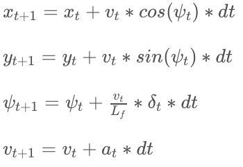

# CarND-Controls-MPC

MPC Implementing in C++ to drive a vehicle in a simulator environment!
---

In this project we use the Udacity's simulator again to drive the car using MPC. This time, however, we have different inputs to develop our MPC model : state[<code>x, y , &psi; , &nu;</code>] and actuations[<code>&delta; , a</code>]!

State is composed of x and y (the position of the car in the global cartesian frame), <code>&psi;</code> which is the orientation of the car w.r.t. to x-axis and finally <code>&nu;</code> which is the car velocity.

For the actuators, we have reduced them to two only: <code>&delta; </code> for steering angle and <code>a </code> for acceleration (throttle/brake combined).

Now the model looks like this:

where <code> Lf </code> measures the distance between the front of the vehicle and its center of gravity. The larger the vehicle, the slower the turn rate. It is set as 2.67 in this project.

https://youtu.be/sDMrvQArndQ

The simulator has been open-sourced by Udacity and can be downloaded [here](https://github.com/udacity/self-driving-car-sim/releases)

## Dependencies

* cmake >= 3.5
 * All OSes: [click here for installation instructions](https://cmake.org/install/)
* make >= 4.1
  * Linux: make is installed by default on most Linux distros
  * Mac: [install Xcode command line tools to get make](https://developer.apple.com/xcode/features/)
  * Windows: [Click here for installation instructions](http://gnuwin32.sourceforge.net/packages/make.htm)
* gcc/g++ >= 5.4
  * Linux: gcc / g++ is installed by default on most Linux distros
  * Mac: same deal as make - [install Xcode command line tools]((https://developer.apple.com/xcode/features/)
  * Windows: recommend using [MinGW](http://www.mingw.org/)
* [uWebSockets](https://github.com/uWebSockets/uWebSockets) == 0.14, but the master branch will probably work just fine
  * Follow the instructions in the [uWebSockets README](https://github.com/uWebSockets/uWebSockets/blob/master/README.md) to get setup for your platform. You can download the zip of the appropriate version from the [releases page](https://github.com/uWebSockets/uWebSockets/releases). Here's a link to the [v0.14 zip](https://github.com/uWebSockets/uWebSockets/archive/v0.14.0.zip).
  * If you have MacOS and have [Homebrew](https://brew.sh/) installed you can just run the ./install-mac.sh script to install this.
* [Ipopt](https://projects.coin-or.org/Ipopt)
  * Mac: `brew install ipopt --with-openblas`
  * Linux
    * You will need a version of Ipopt 3.12.1 or higher. The version available through `apt-get` is 3.11.x. If you can get that version to work great but if not there's a script `install_ipopt.sh` that will install Ipopt. You just need to download the source from the Ipopt [releases page](https://www.coin-or.org/download/source/Ipopt/) or the [Github releases](https://github.com/coin-or/Ipopt/releases) page.
    * Then call `install_ipopt.sh` with the source directory as the first argument, ex: `bash install_ipopt.sh Ipopt-3.12.1`.
  * Windows: TODO. If you can use the Linux subsystem and follow the Linux instructions.
* [CppAD](https://www.coin-or.org/CppAD/)
  * Mac: `brew install cppad`
  * Linux `sudo apt-get install cppad` or equivalent.
  * Windows: TODO. If you can use the Linux subsystem and follow the Linux instructions.
* [Eigen](http://eigen.tuxfamily.org/index.php?title=Main_Page). This is already part of the repo so you shouldn't have to worry about it.
* Simulator. You can download these from the [releases tab](https://github.com/udacity/CarND-MPC-Project/releases).

## Basic Build Instructions

1. Clone this repo.
2. Make a build directory: `mkdir build && cd build`
3. Compile: `cmake .. && make`
4. Run it: `./mpc`.

On BASH-enabled environments you may also run the `build.sh` script to build the project and create a symbolic link to the executable in the base project directory.
